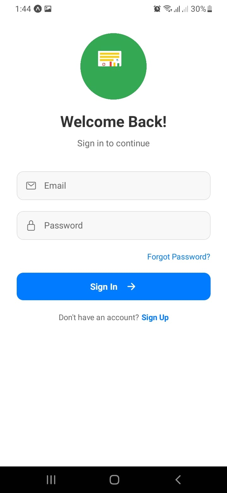
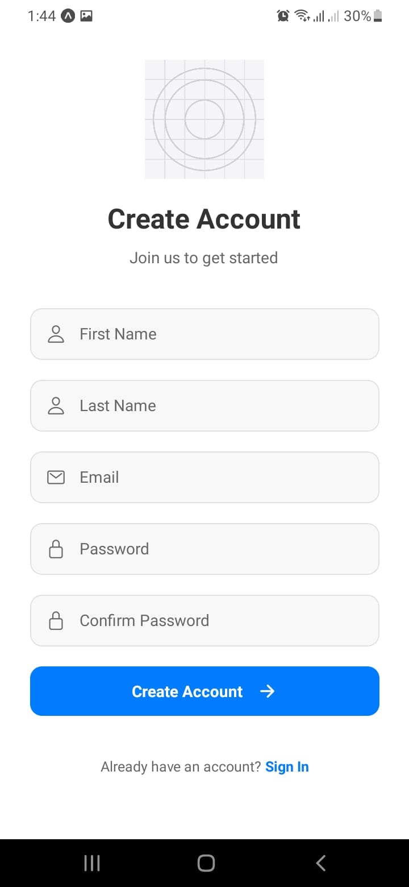
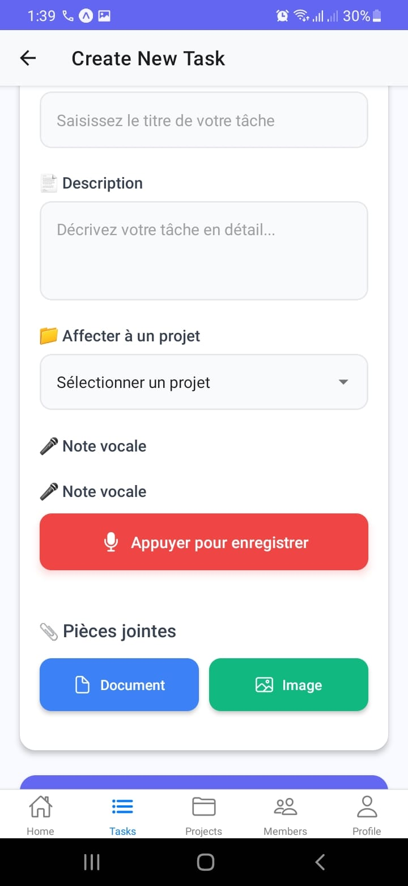
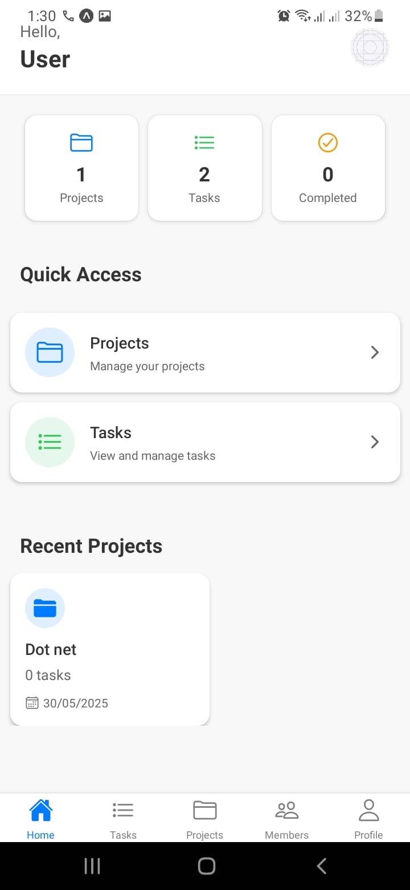
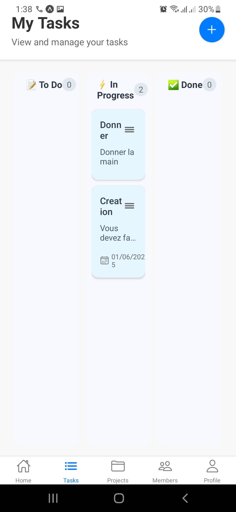
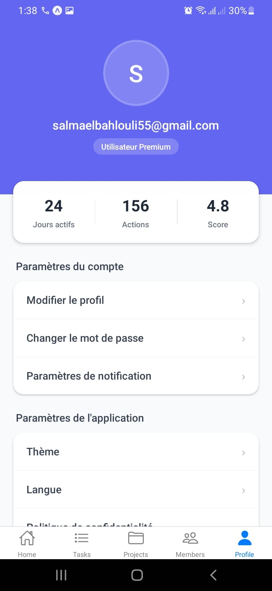

# 📱 DevManage - Application de Gestion de Projets

## 🎯 À propos de l'application

DevManage est une application mobile moderne qui vous permet de gérer vos projets de développement de manière simple et efficace. Que vous soyez chef de projet ou membre d'une équipe, cette application vous aidera à organiser et suivre vos tâches quotidiennes.

## ✨ Fonctionnalités principales

### 📋 Gestion des projets
- Créer et gérer vos projets
- Ajouter des membres à vos projets
- Suivre l'avancement des projets
- Visualiser les statistiques de performance

### 👥 Gestion des équipes
- Ajouter des membres à vos projets
- Assigner des tâches aux membres
- Suivre les responsabilités de chacun
- Gérer les permissions

### ✅ Gestion des tâches
- Créer et assigner des tâches
- Suivre l'état d'avancement
- Filtrer et rechercher des tâches
- Gérer les priorités

## 📱 Comment utiliser l'application

### 1. Connexion
- Ouvrez l'application
- Connectez-vous avec vos identifiants
- Si vous n'avez pas de compte, créez-en un

### 2. Créer un projet
- Appuyez sur le bouton "+" en bas de l'écran
- Remplissez les informations du projet
- Ajoutez une description
- Définissez la date de début et de fin

### 3. Ajouter des membres
- Dans votre projet, appuyez sur "Membres"
- Cliquez sur "Ajouter un membre"
- Sélectionnez les membres à ajouter
- Définissez leurs rôles

### 4. Gérer les tâches
- Dans votre projet, accédez à "Tâches"
- Créez une nouvelle tâche
- Assignez-la à un membre
- Suivez son avancement

## 🎨 Interface utilisateur

L'application dispose d'une interface moderne et intuitive :
- Navigation simple entre les écrans
- Design épuré et professionnel
- Thème sombre et clair disponibles
- Animations fluides

## 🖼️ Aperçu des écrans principaux

Voici un aperçu des différents écrans de l'application :

### Écran d'Accueil (Dashboard)
Une vue rapide de vos statistiques et accès aux sections importantes.

### Écran Mes Tâches
Gérez et visualisez toutes vos tâches.

### Écran Profil
Gérez vos informations personnelles et les paramètres de l'application.

## 🔒 Sécurité

- Authentification sécurisée
- Protection des données
- Gestion des permissions
- Sauvegarde automatique

## 💡 Conseils d'utilisation

- Utilisez les filtres pour trouver rapidement vos tâches
- Consultez régulièrement le tableau de bord pour suivre l'avancement
- N'hésitez pas à ajouter des descriptions détaillées aux tâches
- Utilisez les notifications pour rester informé des mises à jour

---
